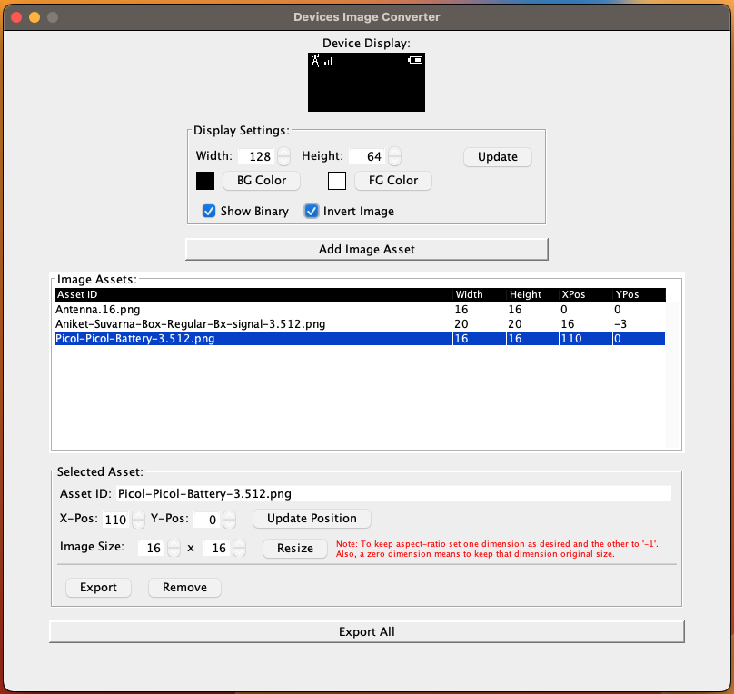

# Device Image Converter
TOOL: This is a Java based tool for working with images in various ways.

This tool was originally created to help convert Images to a binary form that could be
written into a 'C' Type array in a style I like to use when adding graphics to OLED 
Screens attached to micro processors. While there were tools online to convert the images to binary, it was too tedious to format the data for use in the code for a micro-processor that is where this project comes in and saves the day. 

I decided to go with a Java Swing Application because I wanted to show the resized images in a Mock Screen so I could see what the size of the image would look like in the bounds of the display. Also I wanted to be able to resize the image repeatedly quickly, and know what the changes would roughly look like.

Below: Image of main screen of application. Small square at top of window simulates the size of the Device Display which you intend to use for displaying of the graphics. Under that there is a Display Settings section which allows you to resize the Device Display to fit your use-case. Under that is the button which allows you to locate and add images to the application for working with and showing on the simulated Device Display. The Image Assets section is where you can see all images which are being used by the application. You can select the desired image to work with it specifically. Under that is the Export All button which is used to export all of the loaded Image Assets. Below that is the settings for the Selected Asset. This is where you can resize the selected image and then change the location of where it is being rendered in the simulated Device Display. Then at the bottom of that section there is a Export button to export that single selected Image Asset, and a remove button to remove that image from the application.

Below: Image of the Export Window. At the top is the list of Assets to Export, this list has no functionality except to make sure you are aware what assets are being exported and what their scaled sizes are. Following that is the Export As section, which is where you can select the type of export you are wanting. Depending on the export type there may be some Additional Information which is required to properly configure the export. Below that is the Export Where section which allows you to choose to either export the deliverable to either the system clipboard or to a file. Data that makes sense for compilation will all be generated to a single file when exporting, Images however will all export to separate files, the user can select the directory where the resized images are exported to but the application chooses the filenames. Finally an Export button to accept the parameters and continue with the export and a Cancel button to cancel the export process.

Below: Image example of the post export dialogue.

Below: Image example of the export option for a Scaled Image export. There is an option of exporting as a variety of image formats.

Below: Image is an example of the output that is generated for the C-Type Array kind of export. This export was the primary reason for creating this application and is probably the main reason most would have for using this application.

